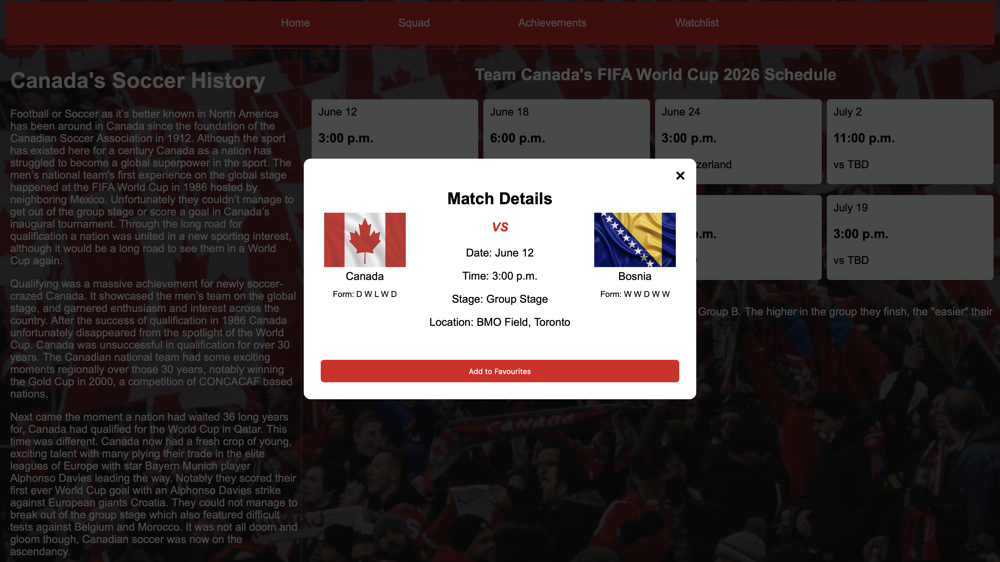

Project Overview – Team Canada Schedule Website

Purpose

The Team Canada Schedule Website is designed to provide users with an easy way to view upcoming games, opponents, dates, and times for Team Canada. Users can also add their favorite games to a watchlist page. The goal of the project is to present schedule information in a clear, organized, and visually appealing way. The website also provide additional information about Team Canada such as achievements since 1912 and a complete team roster.

Main Features

1) Game Schedule Modals
    - Shows detail match between Team Canada and Opponents
    - Shows match date, time, location, team form and match stage
    - Organized in a clean card layout

2) Add To Favorites Button Functionality
    - Each modal includes a "Add to Favorites" button to add the match to the Watchlist page
    - Improves user interactivity and experience
    - Alerts Users if match was already added to favorites and prevent them from adding duplicates

3) Responsive Layout
    - The website includes adjusted layouts for different sizes
    - Modals, match cards navigation bar are all responsive

4) Slider Like Cards
    - The achievements page features card like slides with images to improve user interactivity

5) Custom Styling
    - Background images and themed colors to match the Canadian Soccer Team
    - Styled buttons and containers for better UI

Screenshots OF Live Page

Installation And Setup

1) Installation
    - Clone the repository
    - Open the project folder in Visual Studio Code

2) Dependencies
    - HTML
    - CSS
    - JavaScript
    - Visual Studio Code (code editor)

3) Running the Project

    - Using Visual Studio Code
    - Open the project in Visual Studio Code
    - Install the Live Server extension
    - Select "Open with Live Server"
    - This will launch the website in your browser and automatically refresh when changes are made.

Team Members & Contributions

1) Eton Miller
    - Role: Group Leader, Website Coder, Website Designer
    - Contributions: Created and designed the homepage and acheivement pages. Improved user experience by creating slider like cards to achievements page.

2) Mursal Niazi
    - Role: Web Designer, JavaScript Developer
    - Contributions: Created the players page and create each player cards using Javascript.

3) Navjot Dhami
    - Role: Frontend Developer
    - Contributions: Created the pop up modals to show more details about matches. Implemented user interaction by adding the "Add to favorite" button to modals.

4) Sitakant Sarangi
    - Role: Coder, Code Reviewer
    - Contribrutions: Created the watchlist page, reviewed and commit merges on github. Also created grid layout for matches saved to layout page.

5) Yasser Geelle
    - Role: Website Designer
    - Contributions: Designed the players page

6) Andrew Mcdougall
    - Role: Website Text Editor
    - Contribution: Reviewed and edit all text on homepage and achievements page.

[]
(https://www.youtube.com/watch?v=oZ0cb3Izoss)

Project Links

- [Issue Board](https://github.com/codenoob1738/Canada-FIFA26-schedule/issues)

- [Project Board](https://github.com/users/codenoob1738/projects/1)

Demo GIF of Website

